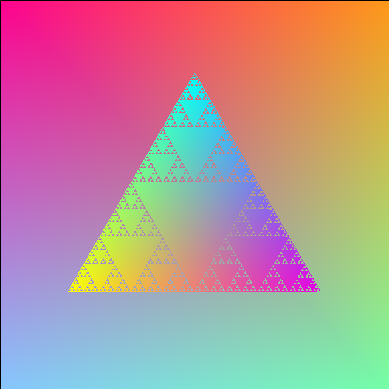
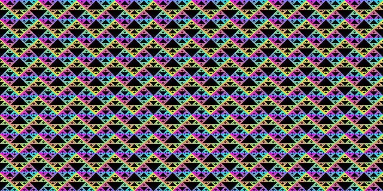
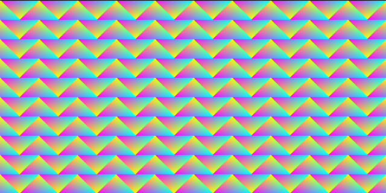
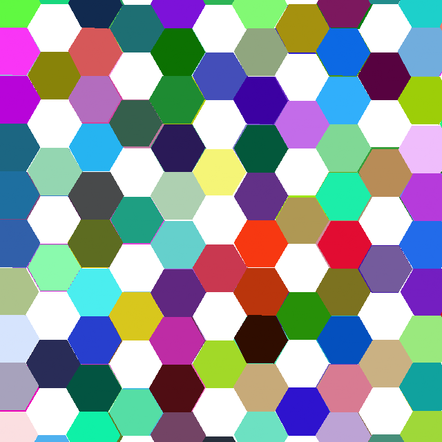
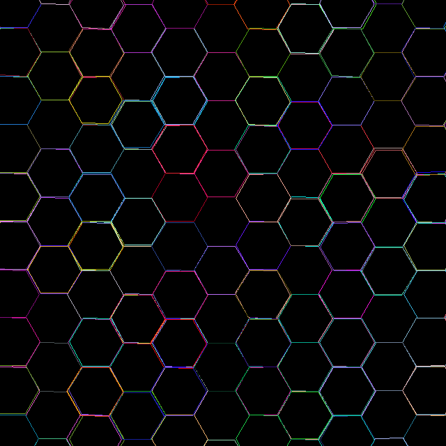
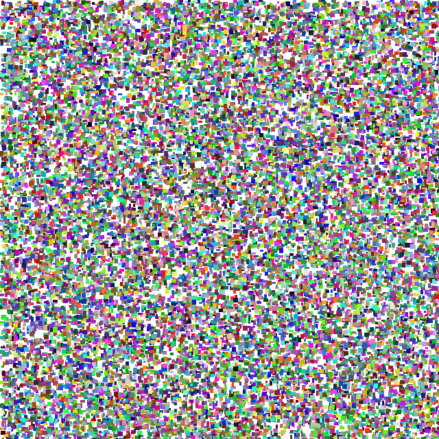

# canvas-drawer

Implements a simple drawing api



## How to build

*Windows*

Open git bash to the directory containing this repository.

```
canvas-drawer $ mkdir build
canvas-drawer $ cd build
canvas-drawer/build $ cmake -G "Visual Studio 16 2019" ..
canvas-drawer/build $ start Draw-2D.sln
```

Your solution file should contain two projects: `pixmap_art` and `pixmap_test`.
To run from the git bash command shell, 

```
canvas-drawer/build $ ../bin/Debug/draw_test
canvas-drawer/build $ ../bin/Debug/draw_art
```

*macOS*

Open terminal to the directory containing this repository.

```
canvas-drawer $ mkdir build
canvas-drawer $ cd build
canvas-drawer/build $ cmake ..
canvas-drawer/build $ make
```

To run each program from build, you would type

```
canvas-drawer/build $ ../bin/draw_test
canvas-drawer/build $ ../bin/draw_art
```

## Supported features

### Required primitives

*line*

Draw a line using the Bresenham algorithm and linear color interpolation. Example: Pokemon Ball.png.

*triangle*

Draw a triangle using barymetric coordinate and linear color interpolation. Adjacent edges are distinguished by two mysterious points (-1, -1) and (-1.1, -1.1). Example: Sierpinski triangle.png, Sierphinski triangle tiling.png, Illusion Tiling.png.

### Custom primitives

*point*

Draw a point with a given color and position. Example: Origami Paper.png.

*polygon*

Draw a polygon with a given color, center point, orientation vector, and number of sides. Example: Filled Hexagon Tiling.png.

*circle*

Draw a circle with a given color, center point, and radius. Example: Pokemon Ball.png.

*sector*

Draw a sector with a give color, center point, orientation vector, and angle. Example: Pokemon Ball.png.

*outlined triangle*

Draw an outlined triangle, i.e. only the edges are shown. Example: Sierpinski triangle.png, Sierphinski triangle tiling.png.

*outlined polygon*

Draw an outlined polygon, i.e. only the edges are shown. Example: Hexagon Tiling.png, Sierphinski triangle tiling.png.

*outlined circle*

Draw an outlined circle, i.e. only the boundary is shown. Example: Pokemon Ball.png.

### Custom features

*alpha blending background*

Create an alpha blending background by specifying the colors of the corner points. Example: Sierpinski triangle.png.

*mid point*

Find the mid point of a given line ab. Example: Sierpinski triangle.png, Sierphinski triangle tiling.png, Filled Hexagon Tiling.png, Hexagon Tiling.png.

*directional vector*

Find the directional vector between two points a and b. Example: Filled Hexagoon Tiling.png, Hexagon Tiling.png.


## Results

*Sierpinski Triangle*

Alpha blending background with rainbow color palette. The Sierpinski Triangle is drawn by first positioning the exterior with outlined polygon primitive and outlined triangle. Then, a recursive algorithm is called to fill the interior. In each iteration, the algorithm finds the mid-points of the three edges. By drawing a filled triangle in the middle, the larger triangle is partitioned into four smaller ones, where the other three are not filled. Apply the algorithm to those unfilled triangles.


*Sierpinski Triangle Tiling*

Tile with Sierpinski triangles.



*Illusion Tiling*

Tile with triangles. This produces an illusion as if the lines are curved. In fact, they are not.



*Hexagon Tiling*

Tile with filled hexagons and outlined hexagons. The tiling was not mathematically calculated beforehand. Instead, we did fractal geometry by replacing each edge of a larger hexagon with a smaller hexagon recursively. The replacement involves finding mid-point and directional vector.





*Origami Paper*

Select an arbitrary point on the picture and make a random decision whether its neighborhood should be painted with a random color (by point primitive). Repeat this process.



*Pokemon Ball*

A drawing of pokemon ball with miscellaneous primitives. The hemispheres are drawn using sectors and the button at the center is drawn using circle. The boundaries are sketched by using outlined circles and lines. They are called repeatedly with a small change of radii/vertices to expand the line width.


